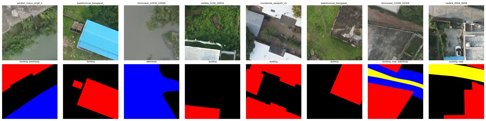

# AI-Based Feature Extraction from Drone Images

SVAMITVA Scheme | IIT Tirupati AI/ML Hackathon | PS-1 Submission

This repository contains an end-to-end geospatial AI pipeline for extracting village-scale map features from drone orthophotos using semantic segmentation.

## Problem
Build an automated system that detects and segments key features from orthophotos:
- Building
- Road
- Waterbody
- Utility
- Bridge
- Railway

## Submission Highlights
- Transformer-based segmentation model: SegFormer (MiT-B3)
- 7-class semantic segmentation pipeline
- Using the available orthophoto data, we generated training tiles and developed the model pipeline.
- Boundary-aware loss design for class imbalance
- Sliding-window inference with TTA for full orthophoto prediction
- Geospatial deliverables: COG raster + GPKG vector outputs

## Repository Structure
- src: core pipeline modules (config, preprocessing, model, training, inference, postprocess, evaluation)
- notebooks: Colab execution notebooks
- shp-file: shapefile samples
- PROJECT_REPORT.md: full submission technical report

## Tech Stack
- PyTorch 2.x
- HuggingFace Transformers (SegFormer)
- Albumentations v2
- Rasterio, GeoPandas, Shapely
- Google Colab (Tesla T4)

## Evaluation Metrics
We evaluate model quality using competition-aligned segmentation metrics:
- Mean IoU (mIoU)
- Mean F1 (mF1)
- Overall Pixel Accuracy (OA)
- Boundary IoU

### Target Performance Benchmarks
| Metric | Target |
|--------|--------|
| mIoU | > 0.65 |
| mF1 | > 0.70 |
| Building IoU | > 0.75 |
| Road IoU | > 0.60 |
| Boundary IoU | > 0.40 |
| OA | > 0.90 |

### Final Submission Metrics (to be updated after final training/inference run)
| Metric | Value |
|--------|-------|
| mIoU | TBD |
| mF1 | TBD |
| Building IoU | TBD |
| Road IoU | TBD |
| Boundary IoU | TBD |
| OA | TBD |

## Pipeline
1. Data setup and manifest creation
2. Orthophoto tiling and mask rasterization
3. Model training (SegFormer + boundary_dice_focal)
4. Inference (sliding window + TTA)
5. Post-processing and vectorization
6. Submission packaging

